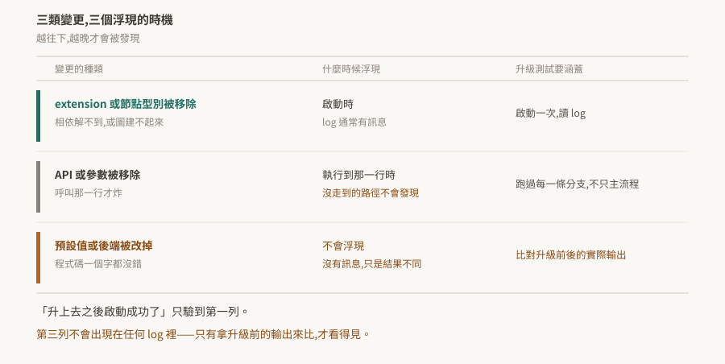

# 11 · 從 Kit 107 升到 110:官方列出的移除與棄用

升級最貴的部分不是改壞掉的那幾行,是**不知道哪幾行會壞**。

這篇整理官方 release notes 明列的移除與棄用項,以及一件比清單本身更重要的事:這三類變更浮現的時機不同,而只有第一類會在啟動時被抓到。

> **驗證狀態**:§2、§3 逐字引自官方 release notes,每條帶官方的 issue 編號。**本 repo 沒有 Kit 環境,未實機驗證任何一條**。§4 是把這些變更接回失效形狀的分析,§6 是待驗清單。

## 1. 中間沒有 108

版本號從 107 直接跳到 110。109 只出現在 Isaac Sim 6.0 的早期開發版(Kit 109.0.2),沒有對應的正式產品線;108 不存在。

看到不連續不用回頭找。對應關係見 [version-matrix](../../version-matrix.md)。

## 2. 官方列出的移除

Kit 110.0 release notes 明列的移除項:

| 子系統 | 移除了什麼 | 官方編號 |
|---|---|---|
| Foundation | "Removed previously deprecated unsafe string methods from `ITokens`." | OMPE-56022 |
| Kit SDK | "The legacy `menu_compatibility` parameter is removed from `ui.Menu` and `ui.Separator`." | OMPE-69110 |
| Kit SDK | settings widget 的既有棄用程式碼「has been removed. Extensions using `omni.kit.widget.settings.deprecated` must migrate to the current API.」 | OMPE-59133 |
| OmniGraph | "The `DeformedPointsToHydra` node is removed as part of OmniHydra deprecation." | OMPE-69458 |
| RTX | "Previously deprecated multi-node rendering support and related networking code are removed." | OMPE-67531 |
| USD Core | "Hydra 2 rendering backend is disabled." | OMPE-68552 |

另外一條屬於更早的變動,但升級時同樣會撞到:`omni.kit.window.viewport` 在 Kit 106 標為 deprecated,**到 107 已從 SDK 移除**。針對 106 寫的程式碼直接跳到 110,會先在這裡斷掉。

## 3. 官方列出的棄用

棄用還能用,但下一版可能就不能:

| 子系統 | 棄用了什麼 | 官方編號 |
|---|---|---|
| Foundation | "`IFileSystem` raw `char*` methods are deprecated in favor of new safe string-based alternatives." | OMPE-57069 |
| Kit SDK | "`omni.renderer_capture` is deprecated. Use alternative capture APIs instead." | OMPE-71542 |
| OmniGraph | "The bundle attributes on `omni.graph.action.OnCustomEvent` are deprecated. Use the non-bundle equivalents instead." | OMPE-72264 |

`omni.renderer_capture` 這條對做離線算圖或自動截圖的流程影響最直接——那類腳本通常不在互動測試的路徑上,升級時容易漏掉。

## 4. 三類變更,三個浮現時機

清單本身只是原料。真正決定升級測試該怎麼做的,是這些變更**什麼時候才會被發現**。

| 變更的種類 | 什麼時候浮現 | 升級測試要涵蓋 |
|---|---|---|
| extension 或節點型別被移除 | **啟動時**,log 通常有訊息 | 啟動一次,讀 log |
| API 或參數被移除 | **執行到那一行時**;沒走到的路徑不會發現 | 跑過每一條分支,不只主流程 |
| 預設值或後端被改掉 | **不會浮現**,沒有訊息,只是結果不同 | 比對升級前後的實際輸出 |

對照 §2 的清單:`DeformedPointsToHydra` 節點移除屬第一類——圖裡用到它就建不起來,而 [05 §5](../../common/05-omnigraph/README.md) 的節點型別查詢抓得到。`menu_compatibility` 與 `ITokens` 的字串方法屬第二類,要走到那行才炸。**「Hydra 2 rendering backend is disabled」屬第三類**——沒有人會報錯,只是算出來的東西可能不一樣。

由此得到一條升級紀律:

> **「升上去之後啟動成功了」只驗到第一列。**

第三類完全不會出現在任何 log 裡,只有拿升級前的輸出來比才看得見。這與 [07 §6](../../common/07-rendering-and-materials/README.md) 是同一件事——輸出的每一項參數都正常,錯的只有內容。

## 5. 升級前後該做的

把 §4 落成動作:

- [ ] **升級前先留基準。** 同一組輸入在 107 上跑一次,把輸出存起來(算圖結果、log、關鍵數值)。升完才想到要比就來不及了。
- [ ] 啟動一次讀 log,找相依解析與節點型別的錯誤(第一類)
- [ ] 跑過每一條分支,包含離線算圖、批次腳本這種不在互動路徑上的(第二類)
- [ ] 拿基準比對輸出(第三類)
- [ ] 順手處理 §3 的棄用項——它們現在還能動,但拖到下一版就變成第二類
- [ ] 版本釘選確認過([10 §4](../../common/10-packaging-and-release/README.md)),避免升級與版本漂移兩件事混在一起查

倒數第二項容易被跳過,理由通常是「還能跑」。代價是下一次升級時,要同時處理兩版累積的棄用。

## 6. 待驗清單

| # | 待驗的斷言 | 怎麼驗 | 什麼算通過 |
|---|---|---|---|
| 1 | §2 各條在 110 上確實不存在 | 逐條寫最小重現,在 110 上跑 | 各自以官方描述的方式失敗 |
| 2 | `DeformedPointsToHydra` 移除後圖建不起來(§4 第一類) | 在 110 上開一個用到該節點的圖 | 建圖失敗且 log 有訊息 |
| 3 | Hydra 2 停用是否改變算圖輸出(§4 第三類) | 同一場景在 107 與 110 各算一張,逐像素比對 | 有差異則確認屬第三類 |
| 4 | §3 的棄用項仍可用 | 在 110 上呼叫,看是否只有警告 | 能動且 log 有 deprecation 訊息 |
| 5 | `omni.kit.window.viewport` 在 107 已不存在 | 在 107 上嘗試啟用 | 找不到該 extension |

第 3 條最值得做:它是唯一一條沒有任何錯誤訊息可依靠的,也是升級驗證最容易漏掉的一類。做完可以回頭補強 §4 那張表。
