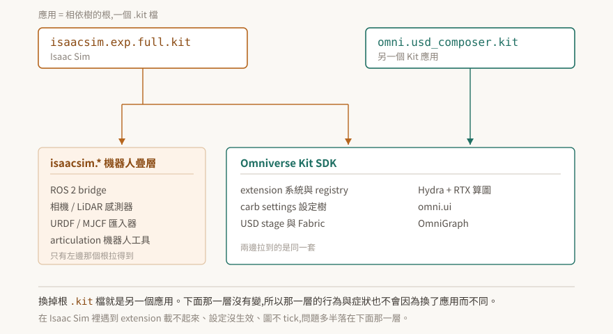

# 01 · Kit 是框架,Isaac Sim 是搭在上面的應用

把 Isaac Sim 當成「一套機器人模擬軟體」,遇到問題時就會往機器人的方向找答案。但 extension 載不起來、啟動參數沒生效、OmniGraph 不 tick、材質變全黑——這幾類症狀跟機器人一點關係都沒有,它們發生在底下那一層,而那一層叫 Omniverse Kit。

這篇把兩者的關係講死:不是靠類比,是靠 Isaac Sim 安裝目錄裡實際擺著的那個檔案。

<p align="center"></p>

> **驗證狀態**:本篇的機制與版本對應都標了官方出處,§4 逐列標明哪些是逐字引用、哪些是從逐字引用推出來的。**本 repo 尚未在自有的 Kit 環境跑過驗證**;§7 給的是自己確認的方法。

## 1. Kit 要解決的根本問題

先問一個不牽涉 NVIDIA 的問題:做一套 3D 應用,哪些東西每次都要重造?

場景要有資料結構、要能存檔、要能多人協作;畫面要算圖;要有視窗、選單、面板;要能讓別人寫外掛擴充;外掛之間會互相依賴,得有人決定誰先載入。這幾塊跟這套應用「是拿來做什麼的」無關——做工廠佈局規劃、做動畫算圖、做機器人模擬,這幾塊都一樣。

真正不同的只有最上面那一層:機器人模擬需要 URDF 匯入器與 ROS 2 橋接,動畫算圖不需要。

Kit 就是把「每次都一樣的那幾塊」抽出來的框架。它自己不是一個能拿來用的產品,而是一套用來組出產品的零件與規則。

## 2. Kit 的答案:應用就是一棵相依樹的根

抽出來之後有個問題:零件那麼多,怎麼決定某一次啟動要載哪些?

Kit 的做法是把這件事寫成設定檔。官方開發者指南的原文是:應用「與 extension 有相同的 TOML 檔設定,只是應用的 TOML 檔叫做 **.kit** 檔」("an App has the same TOML file configuration as extensions, but an App's TOML file is called a **.kit** file"),而且「假定應用是相依樹的『根』」("it is assumed that an application is the 'root' of a dependency tree")。

一個 `.kit` 檔的骨架只有兩段:

```toml
[package]
version = "1.0.0"
title = "My App"

[dependencies]
"omni.kit.uiapp" = {}
```

`[dependencies]` 列出要拉哪些 extension,那些 extension 自己又有相依,一路展開成一棵樹。啟動時 Kit 解析這棵樹、決定順序、把它們載進來。**載進來的那組 extension 就定義了這個應用是什麼**——除此之外沒有別的東西在定義它。

這句話推得動兩個結論,而兩個都會在實務上用到:

- 換一個 `.kit` 檔,就是換一個應用。同一份 Kit SDK 可以同時是好幾個不同的產品。
- 應用之間的差異全部落在「拉了哪些 extension」。共用的那部分,行為必然相同。

## 3. Isaac Sim 是這棵樹的一個根

上面那段如果只是設計理念,還可以說是紙上談兵。但它在 Isaac Sim 上是字面成立的。

Isaac Sim 安裝根目錄底下有個 `apps/` 目錄,預設的 experience 檔是 `isaacsim.exp.full.kit`。官方文件把它描述成「定義載入哪些 extension、以及 Isaac Sim 如何被設定」的主要設定檔。原始碼倉庫裡也擺著同一類檔案,例如 [`source/apps/isaacsim.exp.compatibility_check.kit`](https://github.com/isaac-sim/IsaacSim/blob/main/source/apps/isaacsim.exp.compatibility_check.kit)。

所以「Isaac Sim 是搭在 Kit 上的應用」不是一個方便理解的比喻。它就是一個 `.kit` 檔,加上一組 `isaacsim.*` extension。名字裡的 `exp` 是 experience,`full` 表示這一份拉的是比較完整的那組 extension——同一個安裝底下還有拉得比較少的其他 `.kit` 檔。

延伸出來的一件事值得先記住:**第一次用某個 experience 檔啟動時,相依的 extension 會從 registry 拉下來,官方說可能超過十分鐘**;拉完之後才有快取,同一個 experience 檔再啟動就快了。第一次啟動慢得不合理時,先想到這件事,不要往別的方向查。

## 4. Kit 與 Isaac Sim 的版本對應

兩邊的版本號完全不同步,而排查時常需要知道手上這套 Isaac Sim 底下是哪一版 Kit。

| Isaac Sim | Kit SDK | 這一列的證據等級 |
|---|---|---|
| 4.5.0 | 106.5.0 | 官方 release notes 摘要,**本 repo 未逐字核對原文** |
| 5.0.0 | 107.3.1 | 由 5.1.0 頁面的變更前值反推,見下 |
| **5.1.0** | **107.3.3** | 逐字:「Updated to Kit 107.3.3」,同頁另有「Changed: 107.3.1+isaac.206797.8131b85d.gl -> 107.3.3+isaac.229672.69cbf6ad.gl」 |
| 6.0.0 早期開發版 | 109.0.2 | 社群/摘要來源,**待查證** |
| **6.0.0 GA** | **110.1.1** | 逐字:「Updated to Kit 110.1.1」,同頁「Changed: 110.0.0 -> 110.1.1」 |
| **6.0.1** | **110.1.2** | 逐字:「Updated to Kit SDK 110.1.1 -> 110.1.2」 |

出處:[Isaac Sim 5.1.0 release notes](https://docs.isaacsim.omniverse.nvidia.com/5.1.0/overview/release_notes.html)、[Isaac Sim 最新版 release notes](https://docs.isaacsim.omniverse.nvidia.com/latest/overview/release_notes.html)。

粗體那三列是逐字引用官方 release notes,可以拿來當結論用。另外三列請當成線索,不要拿去做決策。

有兩件事從這張表看得出來:

**Isaac Sim 5.x 對應的是 Kit 107,不是 106。** 106.5.0 停在 Isaac Sim 4.5.0。這個差別會影響到 API 是否存在——例如 `omni.kit.window.viewport` 在 Kit 106 標為 deprecated、到 107 從 SDK 移除,所以同一段程式碼在 4.5 能跑、在 5.0 就不能。

**Kit 的版本號跳號。** 107 之後是 109(早期開發版)、110,沒有 108。看到不連續不要以為自己漏了什麼。

## 5. 症狀該往哪一層找

這是前面幾節唯一實用的產出。判斷方式是問一句:**不裝 Isaac Sim,這個症狀還會不會發生?**

| 症狀 | 落在哪一層 |
|---|---|
| extension 啟用回報成功,能力卻不在 | Kit:extension 生命週期 |
| `--/...` 啟動參數沒生效,或被別的來源蓋掉 | Kit:carb settings 優先序 |
| 第一次啟動卡十幾分鐘 | Kit:registry 拉 extension(§3) |
| 材質全黑而不是素色 | Kit:算圖與 MDL 材質解析 |
| OmniGraph 圖不 tick,或 tick 的時機不對 | Kit:OmniGraph 跟主迴圈走 |
| 屬性寫進 USD 了,runtime 卻沒收下 | Kit:USD stage 與 Fabric 是兩份真值 |
| 關節速度上限改了沒反應 | Isaac:PhysX 機器人層 |
| ROS 2 topic 收不到 | Isaac:`isaacsim.ros2.bridge` |
| 車子轉彎會滑 | Isaac:物理參數與車輛模型 |

上半部那幾條在 Isaac Sim 的文件裡查不到滿意的答案,因為它們不是 Isaac Sim 的行為。往 Kit 的文件查,或往這個 repo 的其他篇查。

## 6. 這個 repo 與 isaac-sim-study 的分工

判準就是上一節那句話:

> 不裝 Isaac Sim 也成立的 → 這裡。需要機器人疊層才成立的 → [isaac-sim-study](https://github.com/wicanr2/isaac-sim-study)。

灰色地帶存在。OmniGraph 是最典型的一個:節點怎麼求值、什麼時候 tick,是 Kit 的機制,收在這裡;`isaacsim.ros2.bridge` 提供哪些節點型別,是機器人疊層,收在那邊。遇到灰的就用上面那句判,並在兩邊互相連結,不要兩邊各寫一份。

## 7. 驗證狀態與怎麼自己確認

本篇的機制敘述來自官方文件,版本對應的粗體列來自官方 release notes 逐字。**本 repo 目前沒有自有的 Kit 環境,以下都還沒有實機執行過。**

手上有 Isaac Sim 或 Kit 的話,三個動作可以把 §2–§4 從「官方這樣寫」升級成「我看到了」:

```bash
# 一、應用的根長什麼樣:列出所有 experience 檔
ls <isaac-sim-root>/apps/*.kit

# 二、打開預設那一份,看 [dependencies] 段拉了什麼
sed -n '1,60p' <isaac-sim-root>/apps/isaacsim.exp.full.kit

# 三、確認底下的 Kit 版本(而不是 Isaac Sim 版本)
<isaac-sim-root>/kit/kit --version
```

第三個指令的輸出如果與 §4 表格對不上,以你機器上的輸出為準,並且該修的是這張表。

**注意第一個指令是列舉查詢。** 回空的時候有兩種可能:那個目錄真的沒有 `.kit` 檔,或是路徑猜錯了。先拿一個確定存在的東西當試紙(例如 `ls <isaac-sim-root>` 本身要看得到東西),再下「沒有」的結論。這個紀律在後面幾篇會反覆出現,因為 Kit 這一層的查詢幾乎都有這個問題。
