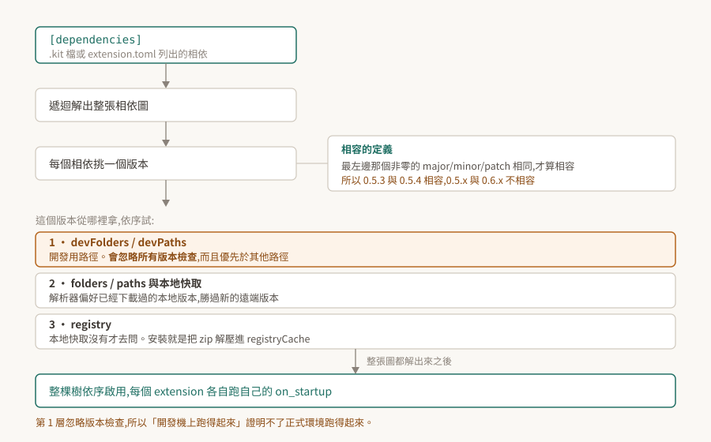

# 02 · extension 系統:相依解析、來源優先序、生命週期

一個 Kit 應用由幾十到幾百個 extension 組成,而 `.kit` 檔裡通常只列十來個。中間那一大段——誰把剩下的拉進來、拉的是哪一版、從哪裡拿、誰先啟動——由 extension 系統決定。

這一段平常不需要知道。會需要知道的時候通常長這樣:同一份程式碼在開發機跑得起來、搬到別台就說找不到 extension;或是啟用回報成功,而該有的能力並不存在。

<p align="center"></p>

> **驗證狀態**:本篇是官方文件的機制整理,引用處給逐字原文。**本 repo 沒有 Kit 環境,全篇未實機驗證**,§8 列出待驗清單與各自的驗法。§7 引的實測樣本來自姊妹 repo 在 Isaac Sim 上的觀察,已標明。

## 1. 根本問題:誰先載、載哪一版、從哪拿

把應用拆成 extension 之後,好處是應用之間可以共用零件([01 §2](../01-kit-is-the-framework/README.md))。代價是三個新問題。

一是**順序**。extension A 用到 B 提供的東西,B 就得先準備好。手寫順序在十個零件時可行,在三百個零件、每個都有自己的相依時不可行。

二是**版本**。A 要 B 的 1.2,C 要 B 的 1.5,只能載一份。得有規則決定哪一份能同時滿足兩邊,以及什麼情況下無解。

三是**來源**。零件不一定在本機。要有地方去拿,拿完要有地方放,下次啟動不該再拿一次。

extension 系統就是這三個問題的答案。下面四節分別是版本規則、順序、來源、生命週期。

## 2. 相容的定義:最左邊那個非零的數字

版本用 semantic versioning,但「相容」的判準值得單獨拿出來講,因為它與直覺不同。官方原文:

> "Versions are considered compatible if their left-most non-zero major/minor/patch component is the same."

看的是**最左邊那個非零的位**,不是固定看 major。

| 版本組合 | 最左非零位 | 相容? |
|---|---|---|
| `1.2.3` 與 `1.9.0` | major = 1 | 是 |
| `1.2.3` 與 `2.0.0` | major 不同 | 否 |
| `0.5.3` 與 `0.5.4` | minor = 5 | 是 |
| `0.5.3` 與 `0.6.0` | minor 不同 | **否** |
| `0.0.3` 與 `0.0.4` | patch 不同 | **否** |

實際影響落在 `0.x` 的 extension 上:主版號是 0 的時候,升一個 minor 就是破壞性變更。自製 extension 停在 `0.1.x` 而相依方寫 `version="0.1"` 時,把版本推到 `0.2.0` 會讓對方解不到——這不是 bug,是規則本身。

`[dependencies]` 的一筆長這樣,除了名字之外可以指定 `tag`、`version`、`optional`、`exact`:

```toml
[dependencies]
"omni.physx" = { version = "1.0", tag = "gpu" }
"omni.kit.uiapp" = {}
```

版本需求也支援 `^1.2.3`、`~1.2`、`=1.2.3` 這類運算子。另外,預發行版在解析時優先權最低。

## 3. 解析與啟用的順序

啟用一個 extension 時,官方的描述是:

> "When an extension is enabled, the manager tries to satisfy all of its dependencies by recursively solving the dependency graph."

遞迴解完整張圖之後才動手啟用:

> "If dependency resolution succeeds the whole dependency tree is enabled in-order so that all dependents are enabled first. The opposite is true for disabling extensions."

**這句話的中文該怎麼落,要小心。** 英文 dependent 指「依賴別人的那一方」,照字面讀是依賴方先啟用;但可用性的角度會期待被依賴的先準備好。官方措辭在這裡不夠明確,而兩種讀法對排查的意義相反。

[03 §4](../03-carb-settings/README.md) 從設定的套用順序推出了一個方向:**被依賴的先啟動,依賴別人的後啟動**——官方關於設定的兩段敘述只有在這個讀法下彼此自洽。**那仍然是推論**,驗法列在 §8 第 1 條。在驗到之前,凡是依賴啟動順序的結論都要標明它建立在這個推論上。

可以確定的是後半句:**停用的順序與啟用相反**。這一點在熱重載時會再出現一次(§6)。

版本選擇上還有一條偏好:

> "Resolver also attempts to use the latest compatible version of a dependency but prefers local (previously chosen and downloaded) over a new remote."

要最新的相容版,但**本地已經有的勝過遠端更新的**。所以「registry 上已經發了新版」不代表下次啟動就會用到它。

## 4. 版本從哪裡拿:三層來源

extension 在指定的資料夾裡被自動搜尋("Extensions are automatically searched for in specified folders"),路徑有三個入口:命令列 `--ext-folder [PATH]` / `--ext-path [PATH]`、設定 `/app/exts/folders` 與 `/app/exts/paths`、C++ API `omni::ext::ExtensionManager::addPath`。

本地沒有就去 registry:

> "When an extension is enabled, the dependency solver resolves all dependencies. If a dependency is missing in the local cache, it will ask the registry for a particular extension and it will be downloaded/installed at runtime."

而「安裝」沒有想像中複雜:

> "Installation is just unpacking of a zip archive into the cache folder (`app/extensions/registryCache` setting)."

解壓進快取而已。這解釋了兩件事:第一次啟動某個 experience 檔為什麼慢([01 §3](../01-kit-is-the-framework/README.md)),以及為什麼那之後就快了。

### 4.1 開發路徑會忽略版本檢查

這一條是「開發機能跑、別台不能跑」最常見的來源。官方對開發用路徑的說明:

> "instead of `--/app/exts/paths` and `--/app/exts/folders`, use `--/app/exts/devPaths` and `--/app/exts/devFolders`. For those paths extension system will ignore all version checks and prioritize them over other paths."

**忽略所有版本檢查,而且優先於其他路徑。** 這在開發時正是想要的行為——改一版就用一版,不必每次調版本號。但它同時讓開發機上的「跑得起來」失去證明力:那台之所以能跑,可能正是因為版本檢查被跳過了。

由此推得一條做法:交付前的驗證要在**沒有 devPaths / devFolders** 的條件下跑一次。這條是從官方敘述推出來的,本 repo 未實測。

## 5. 生命週期:on_startup 與 on_shutdown

Python extension 被啟用時:

> "Enabling an extension loads the python modules specified and searches for children of :class:`omni.ext.IExt` class."

找到之後 "They are instantiated and the `on_startup` method is called"。停用時反過來:"When an extension is disabled, `on_shutdown` is called and all references to the extension object are released."

C++ 原生外掛是同一套,介面名大小寫不同:實作 `omni::ext::IExt` 的外掛會被 acquire 並呼叫 `onStartup`,停用時呼叫 `onShutdown` 並釋放介面。

執行期也可以開關,兩個 API 的差別在時機:`manager.set_extension_enabled_immediate()` 當下就做,`manager.set_extension_enabled()` 排到下一幀。命令列則是 `--enable <extension 名>`,可以重複給。

## 6. 熱重載會連帶重載一大片

> "Extensions can be _hot reloaded_. The Extension system monitors the file system for changes to enabled extensions."

偵測到變動之後的動作是:

> "If it finds any, the extensions are disabled and enabled again (which can involve reloading large parts of the dependency tree)."

**停用再啟用**,而且可能牽動相依樹的一大片。開發時改一個檔案而整個應用出現一段停頓、或是某些狀態被重置,這是其中一個可能的成因。

要關掉的話用 `reloadable` 設定,但它有連帶效果:"This will also block the reloading of all extensions this extension depends on."——它會同時擋掉這個 extension 所依賴的那些的重載。

## 7. 「啟用回傳成功」不是「它活著」

這是 Kit 這一層最值得先知道的失敗形狀。啟用 API 回傳成功,只代表解析與啟用流程沒有拋錯;extension 在 `on_startup` 之後隨即自行收掉,回傳值不會反映這件事。

姊妹 repo 在 Isaac Sim 5.1.2 上記到的樣本:

```
啟用 isaacsim.ros2.bridge -> True
[234.513s] [ext: isaacsim.ros2.bridge-5.1.2] startup
[234.530s] [ext: isaacsim.ros2.bridge-5.1.2] shutdown     ← 17 ms 後自己收掉
```

回傳值是 `True`,而它已經不在了。理由只寫在 log 裡,不會冒進呼叫端的例外處理。

**這個樣本取自 Isaac Sim,但機制屬於 Kit**:啟用與停用由 Kit 的 extension manager 執行,那兩行 `[ext: ...] startup` / `shutdown` 也是 Kit 印的。換一個 Kit 應用,同樣的事情可以照樣發生。

所以生效證明不能看回傳值,要看**能力在不在**。以 OmniGraph 節點型別為例:

```python
registered = set(og.get_registered_nodes())          # 回的是字串
alive = "some.extension.SomeNodeType" in registered
```

而這種列舉查詢自己就有一個坑:**回空同時相容於「東西不在」與「我的查法有洞」**。上面那行如果誤寫成物件屬性的形式,會拋例外、集合停在空的,於是每一個型別都印「沒有」——包括一定存在的那些。

**拿一個確定存在的東西當試紙。** 它若也回「沒有」,壞的是查法,不是東西。這條在 Kit 這一層會反覆用到,因為這裡幾乎所有的狀態查詢都是列舉。

## 8. 待驗清單

本 repo 沒有 Kit 環境,以下都還沒跑過。每一條都寫了驗法與通過條件,拿到環境之後可以逐條升級成實測結論。

| # | 待驗的斷言 | 怎麼驗 | 什麼算通過 |
|---|---|---|---|
| 1 | 啟用順序是被依賴者先起(§3 的歧義) | 啟用一個有明確相依的 extension,讀 log 裡 `[ext: ...] startup` 的先後 | 被依賴的那個的 startup 行先出現,則「被依賴者先起」成立 |
| 2 | `devPaths` 確實跳過版本檢查(§4.1) | 準備一個版本刻意不相容的本地 extension,分別放進 `--/app/exts/paths` 與 `--/app/exts/devPaths` 啟動 | 前者解析失敗、後者載入成功 |
| 3 | 本地版本勝過遠端新版(§3) | 本地留一個舊的相容版,確認 registry 上有更新的相容版,啟動後查實際載入的版本 | 載入的是本地那份 |
| 4 | `0.5.x` 與 `0.6.x` 不相容(§2) | 自製 extension 發 `0.5.0` 與 `0.6.0`,相依方寫 `version="0.5"` | 只有 `0.5.0` 解得到 |
| 5 | 熱重載會連帶重載相依樹(§6) | 改動一個被多方依賴的 extension 的檔案,讀 log 統計出現 shutdown/startup 的 extension 數量 | 數量大於 1 |
| 6 | 啟用回傳成功而 extension 已收掉(§7) | 在純 Kit 應用上,刻意啟用一個相依不滿足的 extension,比對回傳值與 log | 回傳成功而 log 有緊接的 shutdown |

第 6 條最值得優先驗:它決定了後面每一篇「怎麼證明某個東西生效了」的寫法。在拿到自有環境之前,本 repo 對 extension 是否生效一律只採信「能力查詢」,不採信回傳值。
