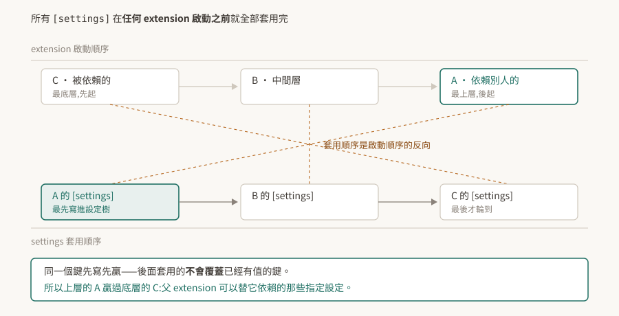

# 03 · carb settings:設定樹、先寫先贏,以及官方沒寫全的優先序

Kit 應用的行為幾乎都掛在同一棵設定樹上:視窗開不開、算圖用哪個後端、extension 去哪裡找、日誌多囉嗦。改它的方式有好幾種——命令列、`.kit` 檔、`extension.toml`、使用者設定檔——而它們碰在一起的時候誰贏,是這一層最常被問、也最容易搞錯的事。

先講結論:**同一個 extension 相依鏈上的 `[settings]` 是「先寫先贏」,而且套用順序是啟動順序的反向**;至於命令列、`.kit`、使用者設定檔之間的完整優先序,官方文件沒有寫成一份完整表述(§7)。

<p align="center"></p>

> **驗證狀態**:本篇引用處給逐字原文。**本 repo 沒有 Kit 環境,全篇未實機驗證**,§8 是待驗清單。§4 是一段推論,已在文中標明它是推論而非官方直述。

## 1. 根本問題:幾百個旋鈕放在哪

應用由幾百個 extension 組成([02](../02-extension-system/README.md))之後,設定會遇到一個結構問題:每個 extension 都有自己的旋鈕,而使用者、應用作者、extension 作者都想調同一批。

各自存各自的檔會導致沒有人能一次看到全貌,也沒辦法從外面覆蓋。Kit 的做法是反過來:**只有一棵樹,所有人都往同一棵樹寫**,差別只在什麼時候寫、寫的優先權多高。

## 2. 設定樹:一個巢狀字典

官方對它的定義很直白:

> "Settings is a runtime representation of typical configuration formats (like json, toml, xml), and is basically a nested dictionary of values."

一個巢狀字典,鍵用 `/` 分層,例如 `/app/exts/folders`。TOML 裡寫成 `app.exts.folders`,命令列寫成 `--/app/exts/folders`,指的是同一個位置。

`extension.toml` 的 `[settings]` 段寫進去的東西落在樹根:

> "Everything under this section is applied to the root of the global **Carbonite** settings (`carb.settings.plugin`)."

慣例上 extension 自己的設定放在 `exts` 命名空間底下、再接 extension 名,避免撞名也方便查找。

## 3. `[settings]` 是先寫先贏

這是本篇最值得記住的一條,而且與直覺相反。官方原文:

> "An important detail is that settings are applied in reverse order of extension startup (before any extensions start) and they don't override each other."

拆成三件事:

**一、時機。** 所有 `[settings]` 在**任何 extension 啟動之前**就套用完了。不是「輪到某個 extension 啟動時才套用它的設定」。所以 extension 在 `on_startup` 裡讀到的設定樹已經是最終狀態,包含那些啟動順序排在它後面的 extension 所寫的值。

**二、順序。** 套用順序是啟動順序的**反向**。

**三、不覆蓋。** 後套用的不會蓋掉已經有值的鍵。

三件事合起來就是先寫先贏:反向套用讓啟動順序靠後的 extension 先寫,而先寫的那個贏。官方接著給了這個設計的用途:

> "Therefore a parent extension can specify settings for child extensions to use."

父 extension 可以替它依賴的那些指定設定。這解釋了為什麼要設計成「不覆蓋」——如果後寫的會蓋掉先寫的,底層 extension 的預設值就會蓋掉上層應用的指定,而那是反的。

實務上的意義:**你的 `.kit` 應用檔寫的值,勝過它拉進來的那些 extension 自己的預設。** 想調某個 extension 的設定,寫在自己的應用檔裡就有效,不必去改對方的 `extension.toml`。

## 4. 由此推得的啟動順序

[02 §3](../02-extension-system/README.md) 留了一個沒有結論的問題:官方說啟用時「all dependents are enabled first」,而 dependent 一詞照字面是「依賴別人的那一方」,與「被依賴者先準備好」的預期相反。

§3 這段機制可以把它推出來,**推論如下,尚未實測**:

官方說父 extension 能替子指定設定,而這件事只有在「父的 `[settings]` 先寫進去」時才成立。先寫要靠反向套用,反向套用要成立的話,父在啟動順序上必須排在**後面**。也就是:

> **被依賴的先啟動,依賴別人的後啟動。**

兩段官方敘述只有在這個讀法下彼此自洽。這也符合可用性的直覺——被依賴的東西要先準備好。

**這是推論,不是官方直述。** 驗法在 [02 §8](../02-extension-system/README.md) 第 1 條:讀 log 裡 `[ext: ...] startup` 的先後即可判定。在驗到之前,凡是依賴啟動順序的結論都要標明它建立在這個推論上。

## 5. 命令列 `--/` 的形狀

任何設定都能從命令列改:

> "Any setting can be changed via command line using `--/` prefix"

格式是 `--/[path/to/setting]=[value]`,路徑用 `/` 分層並以 `--/` 開頭。

陣列有兩種寫法:指定單一元素的索引,或整包給值 `[value0,value1,...]`。布林值大小寫不拘,`true` / `false` 可用,`0` / `1` 也會被當成整數轉過去。

順帶記一下日誌旗標:`-v` 開 info、`-vv` 開 verbose。排查設定沒生效時,這兩個通常比猜快。

## 6. `/persistent`:會活過這次啟動的那些

> "All settings stored in a `/persistent` namespace persist between sessions. They are automatically stored to and loaded from **user config**."

`/persistent` 底下的東西會自動存進使用者設定檔,下次啟動再載回來。命名空間本身就是開關,不需要另外宣告。

這帶來一個排查上的陷阱:**同一台機器上「上次改過的值」會活著回來**。在 A 機器重現不了 B 機器的問題時,兩邊的使用者設定檔是第一個要比對的地方,而不是程式碼。反過來說,要確保實驗乾淨,得先確認 `/persistent` 底下沒有殘留的舊值。

## 7. 完整的優先序,官方沒有寫全

`.kit` 檔、`extension.toml`、使用者設定檔、命令列、環境變數碰在一起時誰贏——**本 repo 沒有在官方文件裡找到一段完整陳述這件事的文字**。

查過的地方:kit-manual 的 Configuration 頁、dev-guide 的 Settings 頁、kit-manual 的 Extensions in-depth 頁。找到的是分散的片段:`--/` 可以改任何設定、系統層級的設定檔可以覆蓋任何設定、`[settings]` 在相依鏈上先寫先贏(§3)。這幾條拼不出一張完整的優先序表。

**這是「本 repo 查到的」,不是「官方沒有」。** 不排除寫在別的頁面或別的版本。真的需要一個確定的答案時,量比查快:

```bash
# 一、把當下的設定樹整棵 dump 出來(設定鍵名依版本可能不同,先確認它存在)
kit <你的.kit檔> --/app/settings/dumpToFile=/tmp/settings.json --/app/quitAfter=1

# 二、同一個鍵,從兩個入口各給一次不同的值,看哪個留在 dump 裡
kit <你的.kit檔> --/exts/my.ext/threshold=999 ...
```

單變數對照:一次只改一個入口,看 dump 出來的值是哪一個。要判定的入口有五個,兩兩比較即可排出全序。

⚠ **dump 出來看得到某個鍵,不代表 runtime 真的照它跑。** 這是 Kit 這一層的第三種常見假象——寫得進去不等於被採用。要證明某個設定真的生效,把它設成一個極端值,看行為有沒有跟著變。

## 8. 待驗清單

| # | 待驗的斷言 | 怎麼驗 | 什麼算通過 |
|---|---|---|---|
| 1 | `[settings]` 先寫先贏(§3) | 做兩個 extension,父依賴子,兩邊的 `[settings]` 寫同一個鍵不同值,啟動後讀該鍵 | 讀到父寫的值 |
| 2 | 設定在任何 extension 啟動前就套用完(§3) | 在最先啟動的 extension 的 `on_startup` 裡讀一個只由最後啟動者宣告的鍵 | 讀得到值 |
| 3 | 被依賴者先啟動(§4 的推論) | 讀 log 裡 `[ext: ...] startup` 的先後 | 被依賴的那個先出現 |
| 4 | 五個入口的完整優先序(§7) | 單變數對照,兩兩比較 | 排得出一個穩定的全序 |
| 5 | `/persistent` 會跨 session 留存(§6) | 設一個 `/persistent/...` 的值,關掉重開再讀 | 值還在,且能在使用者設定檔裡找到 |
| 6 | dump 得到不等於生效(§7 的警語) | 挑一個有可觀察行為的設定,設極端值 | 行為跟著變才算生效 |

第 4 條做完就能補一張優先序表回 §7,那是這一篇目前最大的缺口。
