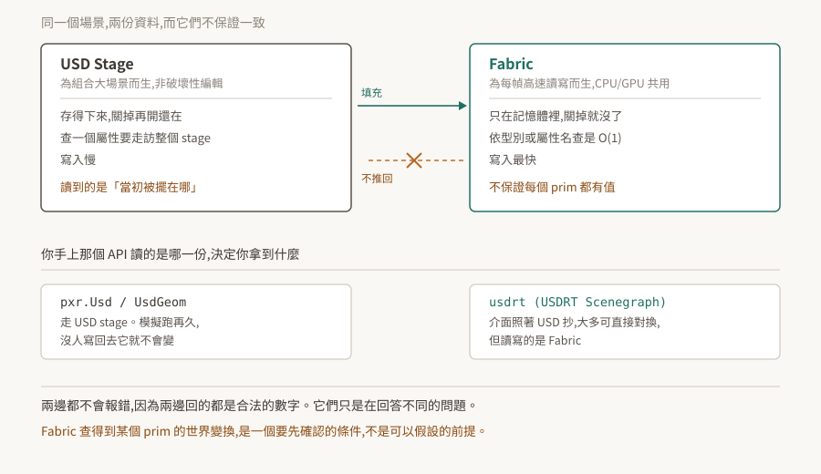

# 04 · USD stage 與 Fabric:兩份真值,以及你正在讀哪一份

模擬跑了十分鐘,程式讀出來的物件座標一動也沒動。沒有例外、沒有錯誤訊息,那個數字看起來完全合理——它只是回答了另一個問題。

Kit 執行期,同一個場景的資料同時存在於兩個地方,而兩邊都不會因為「你問錯人了」而報錯。

<p align="center"></p>

> **驗證狀態**:機制引用官方 USDRT 文件逐字。**本 repo 沒有 Kit 環境,未實機驗證**;§4 引的實測樣本來自姊妹 repo 在 Isaac Sim 5.1 上的觀察,已標明來源與組態。§6 是待驗清單。

## 1. 根本問題:USD 為組合而生,不為每幀查詢而生

USD 的設計目標官方寫得很清楚:

> "USD is Pixar's library that allows large-scale scenes to be composed from hundreds or thousands of component layers and modified using non-destructive operations."

上千個圖層組合起來、非破壞性編輯——這是為了讓一大群人協作編輯同一個場景。代價落在查詢上:找「所有某型別的 prim」或「某個名字的屬性」得走訪整個 stage,官方給的複雜度是 `O(n) - traversal of entire stage`,寫入速度標的是 `Slow`。

編輯場景時這個代價無所謂,一秒鐘做不到一次。但算圖每秒要做六十次,物理每秒可能上百次。**同一套資料結構同時滿足「好編輯」與「每幀查一遍」是做不到的**,兩邊要的東西相反。

## 2. Fabric 的答案

於是有第二份:

> "Fabric is the Omniverse library that enables high-performance creation, modification, and access of scene data, as well as communication of scene data between CPU and GPU and other Fabric clients on a network."

同一份官方比較表裡,Fabric 的查找成本是 `O(1) - query`、寫入速度是 `Fastest`,而儲存性質是 **`Transient, in-memory only`**。

存取它的 API 刻意做成 USD 的樣子:

> "USDRT Scenegraph API is an Omniverse API that mirrors the USD API (and is pin-compatible in most cases), but reads and writes data to and from Fabric instead of USD."

介面照著 USD 抄、多數情況可以直接對換,但**讀寫的對象換了一個**。這個設計讓移植容易,同時讓「我到底在讀哪一份」變得不容易從程式碼看出來——兩邊的呼叫長得幾乎一樣。

## 3. 資料只往一個方向流

Fabric 的內容從哪來:

> "Data in Fabric can be populated from the local composed USD stage, but may also be generated procedurally or populated over the network."

可以從 USD stage 填充,但也可以是程式生的、或從網路來的。所以 Fabric 裡有的東西**不一定在 USD stage 上有對應**。

反方向則沒有:

> "Fabric is a transient data store on top of USD, so values set in Fabric are not automatically pushed back to the USD stage."

**寫進 Fabric 的值不會自動回到 USD stage。** 這是設計本身,不是遺漏——Fabric 存在的理由之一就是讓各個系統交換資料時不必回寫 USD。

由此得到兩條實務推論:

- 在 Fabric 上改了東西然後存檔,**存出來的檔案裡不會有那些改動**,除非明確寫回 USD。
- 讀 USD stage 拿到的是「當初被寫進去的值」。模擬跑再久、Fabric 那邊變化再大,沒有人寫回去,它就不會變。

啟用 Fabric Scene Delegate 的情況下,USD 那一側的改動會即時反映過去:"Fabric is populated from the USD Stage while Fabric Scene Delegate is enabled",而且 "any transform change on any prim in USD is immediately reflected as an update in Fabric"。方向依然是 USD → Fabric。

## 4. Fabric 裡有沒有值,是條件不是前提

這一節是本篇最容易踩的地方。

「Fabric 是執行期的即時資料」聽起來像是「任何 prim 隨時都能從 Fabric 讀到最新位置」。實際上一個 prim 在 Fabric 上有沒有世界變換,取決於好幾個條件。

官方描述在 Fabric Scene Delegate 下從 USD 填充時的行為是:"every Boundable prim has two new attributes created in Fabric"。其中 `omni:fabric:worldMatrix` 是 "the local-to-world transform of the prim, as a `GfMatrix4d`",性質標的是 **computed, cached, read-only**,而且 "updated when `updateWorldXforms()` is called"。

拆出來的條件:Fabric Scene Delegate 要啟用、prim 要是 Boundable、世界變換要在 `updateWorldXforms()` 被呼叫之後才是新的。任何一條不成立,那個值就可能不存在或是舊的。

查詢用的 `RtXformable::HasWorldXform()`,官方定義是:

> "Check if the Fabric prim has any world transform attributes"

**它問的是「這個 prim 在 Fabric 上有沒有被寫入 world transform 屬性」,不是「有沒有同步過」的旗標。** 值的來源可以是明確建立、`SetWorldXformFromUsd()`,或模擬端寫入。

姊妹 repo 在 Isaac Sim 5.1 的一個場景組態上實測到的結果:

```
probe_pose target=/World/RT-A/main/fork_liftA1 → HasWorldXform=False
probe_pose target=/World/RT-A/main/fork_tilt   → HasWorldXform=False
```

那個場景的 Fabric 沒有替那些 prim 填世界變換。**這是該組態下的觀察,不是通則**——換一個應用、換一組 extension、FSD 開或關,結果可以不同。可以當通則用的是它的形狀:

> Fabric 查得到某個 prim 的世界變換,是一個**要先確認的條件**,不是可以假設的前提。

Kit 106.0 起 Fabric Scene Delegate 在 Composer 與 Explorer 預設啟用,但那是那兩個應用的組態,不是 Kit 的普遍保證。自己的 `.kit` 應用開不開,由自己的設定決定([03](../03-carb-settings/README.md))。

## 5. 你正在讀哪一份

判斷方法很直接:看你用的是哪一組 API。

| 你呼叫的 | 讀的是 | 拿到什麼 |
|---|---|---|
| `pxr.Usd` / `pxr.UsdGeom` 那一套 | USD stage | authored 值。沒人寫回去就不會變 |
| `usdrt` 的對應類別 | Fabric | 執行期值,前提是那個 prim 在 Fabric 上真的有 |

兩邊都不會因為問錯而報錯,因為兩邊回的都是合法的數字。

排查時的動作順序:**先確認自己讀的是哪一份,再懷疑值不對**。同一個 prim 用兩條路徑各讀一次、把兩個值印出來,比讀程式碼快。兩個值不同不代表有 bug——那正是設計。

這與 [02 §7](../02-extension-system/README.md) 的「啟用回傳成功不是它活著」、[03 §7](../03-carb-settings/README.md) 的「dump 得到不等於被採用」是同一個家族的問題:**回傳值合法,不代表它回答了你問的問題**。Kit 這一層的多數難查問題都長這個樣子。

## 6. 待驗清單

| # | 待驗的斷言 | 怎麼驗 | 什麼算通過 |
|---|---|---|---|
| 1 | 寫進 Fabric 不會回到 USD(§3) | 用 `usdrt` 改一個 prim 的變換,再用 `pxr.Usd` 讀同一個屬性,並存檔檢查 | USD 側的值不變,存出的檔案也沒有那個改動 |
| 2 | USD 側改動即時反映到 Fabric(§3) | FSD 啟用下改 USD 的 transform,立刻用 `usdrt` 讀 | 讀到新值 |
| 3 | `HasWorldXform` 在預設純 Kit 應用上是否為 True(§4) | 起一個最小 `.kit` 應用,對場景裡的 Boundable prim 逐一查 | 記錄 True/False 的比例與 FSD 開關的對應 |
| 4 | FSD 關閉時 Fabric 是否仍被填充(§4) | 同上,切換 FSD 設定各跑一次 | 兩次結果不同則確認 FSD 是條件之一 |
| 5 | `updateWorldXforms()` 之後值才更新(§4) | 改 USD transform,不呼叫該函式先讀一次,呼叫後再讀 | 兩次值不同 |

第 3 條做完可以把 §4 的實測樣本從「Isaac Sim 上的一個組態」升級成「純 Kit 環境下的通則或反例」,那是這一篇目前最大的缺口。

⚠ 這五條全部是列舉或狀態查詢,**每一條都要配正對照**([02 §7](../02-extension-system/README.md)):拿一個確定有值的 prim 當試紙。它若也回「沒有」,壞的是查法,不是資料。
