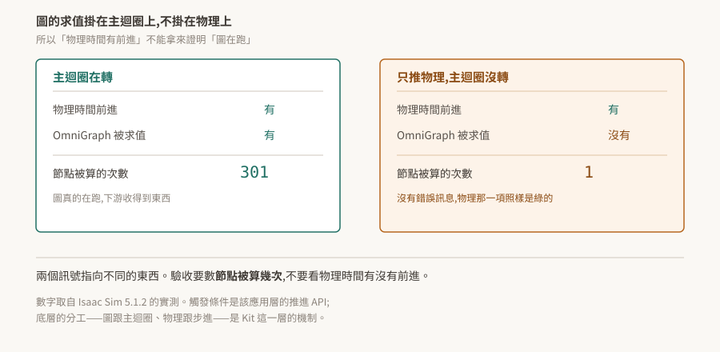

# 05 · OmniGraph:圖是 USD 資料,而求值不在物理迴圈上

OmniGraph 是 Kit 的視覺化節點圖:拉節點、連線,不寫程式碼也能讓場景動起來。

這一層有兩件事值得先知道,而且兩件都不是從介面上看得出來的。第一,那張圖本身就是 USD 資料——節點型別是一個屬性,連線是 USD 的 attribute connection,所以圖可以完全離線寫出來。第二,**圖什麼時候被算,跟物理什麼時候前進,是兩回事**。

<p align="center"></p>

> **驗證狀態**:§2、§3 引用官方 OmniGraph 文件逐字。**本 repo 沒有 Kit 環境,未實機驗證**;§4、§5 的數字與 log 來自姊妹 repo 在 Isaac Sim 5.1.2 上的實測,已標明來源與觸發條件。§6 是待驗清單。

## 1. 根本問題:這張圖要存在哪

視覺化腳本工具的老問題是「圖存哪」。存成自訂格式就要自己寫序列化、版本遷移、diff 工具,而且它跟場景是兩個檔案,搬家時容易走散。

OmniGraph 的做法是不另外發明格式:**圖就存在 USD 場景裡**,用 USD 既有的機制表達。節點是 prim,節點型別是 prim 上的一個屬性,連線是 USD 本來就有的 attribute connection。

代價是 USD 的表達方式不像專用格式那麼直覺;好處相當大——版本控制、引用、layer 疊加、非破壞性編輯,全部免費繼承。

## 2. 節點型別與連線都是 USD 屬性

一個節點在 USD 裡帶兩個 token:

```
token node:type = "omni.graph.nodes.Times2"
int node:typeVersion = 1
```

官方對這兩個值的說明:

> "The value of `node:typeVersion` must match the 'version' value specified in the .ogn file"

> "The value of `node:type` is an extended version of the name key specified in the .ogn file, with the extension prepended."

型別名前面掛的是提供它的 extension 名。所以節點型別存不存在,取決於對應的 extension 有沒有真的活著——這把 [02 §7](../02-extension-system/README.md) 那條直接接了起來:extension 啟用回傳成功而它隨即收掉的話,這裡就會變成「節點型別不存在」。

連線用 USD 原生的寫法:

```
custom double inputs:a.connect = </Graph/times_2_node_1.outputs:two_a>
```

官方明說這不是比喻:

> "OmniGraph connections between attributes are implemented and handled directly within OmniGraph they are published within USD as _UsdAttribute_ connections."

**推得的一件事**:既然節點型別與連線都只是 USD 屬性,那麼整張圖可以用純 USD API 離線寫出來,不需要開 OmniGraph 的介面、也不需要在 Kit 執行期組裝。這對「場景由程式生成」「圖要進版控 diff」這類需求很有用。**這是從上述機制推的,本 repo 未實測**;驗法在 §6。

## 3. 結構在 USD,值在 Fabric

這裡有個容易混淆的分工,官方講得很直接:

> "Although the attributes are represented in USD, the actual values OmniGraph nodes use are stored in Fabric. These are the values that need to be synchronized by OmniGraph."

**屬性的宣告在 USD,節點實際使用的值在 Fabric,而同步是 OmniGraph 的責任。**

接著 [04](../04-usd-stage-and-fabric/README.md) 讀:那一篇說「寫進 Fabric 的值不會自動推回 USD stage」,這裡說 OmniGraph 需要同步那些值。兩者不衝突,差別在「自動」二字——Fabric 本身不會回寫,是 OmniGraph 這個系統主動去做同步。

官方架構文件描述的典型資料流是 USD 填充節點資料到 Fabric、Fabric 供計算、OmniGraph 把結果寫回 Fabric、Fabric 再把算完的資料同步回 USD。**最後那一段(Fabric → USD)本 repo 只取到摘要,沒有取到逐字原文,列為待查證**;前面幾段與 §2 引的那句逐字一致。

實務上的意思:在 USD 上讀一個 OmniGraph 節點的屬性值,讀到的不一定是它這一幀實際用的值。要確定的話,查 Fabric 那一份([04 §5](../04-usd-stage-and-fabric/README.md))。

## 4. 圖跟著誰求值

這是本篇最貴的一條。

**圖的求值掛在應用主迴圈上,物理前進掛在物理步進上,兩者不是同一個東西。** 只推進物理而主迴圈沒有轉的時候,物理時間照樣前進,而圖完全不被求值——沒有錯誤訊息,物理那一項的檢查照樣通過。

姊妹 repo 在 Isaac Sim 5.1.2 上的實測,用該應用層 API 只推物理(`render=False`)與正常跑各一輪:

| | 只推物理 | 正常跑 |
|---|---|---|
| `OnTick` 被算的次數 | **1** | 301 |

同一份紀錄裡還有一個不同觸發條件、同樣形狀的案例:headless 模式下 OmniGraph 不 tick。

**這兩個觸發條件都來自應用層(Isaac Sim 的推進 API、該應用的 headless 組態),但底層的分工是 Kit 的。** 換一個 Kit 應用,只要它也有「推進物理但不轉主迴圈」的路徑,同樣的事情就會發生。寫自己的 `.kit` 應用時,這條要自己驗一次(§6)。

由此得到一條驗收紀律:

> **不要拿「物理時間有前進」當成「模擬在跑」。** 兩個訊號指向不同的東西。

## 5. 生效證明:兩個查詢

要證明圖真的在運作,查兩件事,而兩件都不能看回傳值。

**一、節點型別註冊了沒。** 這決定圖能不能被建起來。

```python
registered = set(og.get_registered_nodes())          # 回的是字串
alive = "omni.graph.action.OnPlaybackTick" in registered
```

⚠ **這是列舉查詢,一定要配正對照。** `og.get_registered_nodes()` 回的是字串;若誤照物件屬性寫成 `{n.get_node_type_name() for n in ...}` 會拋 `AttributeError`,集合停在空的,於是每個型別都印「沒有」——**包括一定存在的那個**。拿一個確定存在的型別當試紙,它若也回「沒有」,壞的是查法。

**二、節點被算了幾次。** 這決定圖有沒有在跑。數某個 tick 節點的計算次數,跨若干幀比對它有沒有增加。§4 那張表就是這個做法的產物:數字是 1 或 301,結論完全不同,而兩種情況都沒有錯誤訊息。

這與 [02 §7](../02-extension-system/README.md)、[03 §7](../03-carb-settings/README.md)、[04 §5](../04-usd-stage-and-fabric/README.md) 是同一件事的第四種穿法:**Kit 這一層的東西壞掉時,多半不是拋例外,是安靜地回一個合法的值。** 每一層的驗收都要找到一個「能力在不在」的訊號,不能只看呼叫有沒有成功。

## 6. 待驗清單

| # | 待驗的斷言 | 怎麼驗 | 什麼算通過 |
|---|---|---|---|
| 1 | 圖可以用純 USD API 離線寫全(§2) | 不開 Kit,用 `pxr` 寫一個帶 `node:type`、`node:typeVersion` 與 `.connect` 的 USD 檔,再用 Kit 開起來 | 圖出現在編輯器裡且能被求值 |
| 2 | 節點型別名前綴就是提供它的 extension(§2) | 停用某個提供節點的 extension,再查 `og.get_registered_nodes()` | 該前綴的型別全部消失,其餘不受影響 |
| 3 | 純 Kit 應用上也有「物理前進而圖不 tick」的路徑(§4) | 在自製 `.kit` 應用上找出只推進物理的呼叫,數節點計算次數 | 物理時間增加而計算次數不變 |
| 4 | headless 下圖是否 tick(§4) | 同一份圖,GUI 與 headless 各跑一次,數計算次數 | 兩者次數接近則 headless 不是條件 |
| 5 | Fabric 算完的值會同步回 USD(§3,待查證) | 讓圖算出一個輸出值,分別從 `usdrt` 與 `pxr` 讀該屬性 | 兩邊一致則同步存在;不一致則需明確呼叫 |
| 6 | USD 上讀到的節點屬性值不等於這一幀用的值(§3) | 圖運作中,同一個輸入屬性兩條路徑各讀一次 | 兩值不同 |

第 3 條最值得優先:它決定了 §4 那條紀律在純 Kit 環境下是不是同樣成立,而目前的證據全部來自 Isaac Sim。
