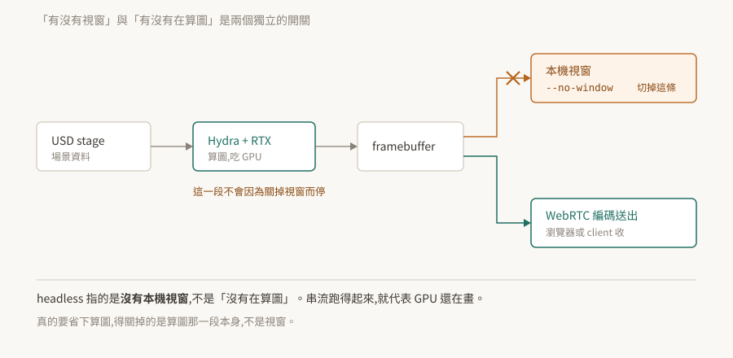

# 06 · 執行模式:headless 不是「沒在算圖」

把 Kit 應用搬上遠端伺服器時,第一個要做的決定是「畫面怎麼辦」。而這個決定常常被簡化成一個二選一——有 GUI 或 headless——於是產生一個代價不小的誤會:**以為 headless 就是不吃 GPU**。

實際上那是兩個獨立的開關。

<p align="center"></p>

> **驗證狀態**:§2–§4 引用官方文件逐字。**本 repo 沒有 Kit 環境,未實機驗證**;§5 的限制與數字來自姊妹 repo 在 Isaac Sim 5.1 上的實測,已標明。§7 是待驗清單。

## 1. 根本問題:畫面要給誰看

一個 3D 應用算完一幀之後,那張圖有三種去處:畫到本機視窗、編碼後送去別的機器、或是誰也不給(只是為了讓下游元件有東西可讀)。

這三種需求對應的不是三種「模式」,而是**輸出路徑要不要接上**。把它想成模式,就會問出「headless 模式下 GPU 是不是就閒著」這種答不對的問題。

## 2. 兩個獨立的開關

官方對 `--no-window` 的描述只有一句,但這句把事情講死了:

> "The `--no-window` flag keeps the editor UI hidden while still running the WebRTC stream."

**隱藏編輯器介面,而串流照跑。** 串流要送出畫面,畫面要先算出來——所以算圖那一段完全沒有停。

由此得到的判斷:

- `--no-window` 管的是**本機視窗**這條輸出路徑。
- 算圖本身是另一件事,關掉視窗不會關掉它。
- 遠端伺服器上跑 `--no-window` 而 GPU 使用率很高,是正常的,不是設定錯了。

真的想省下算圖,要動的是算圖那一段本身(例如不啟用算圖相關的 extension、或不建立 viewport),不是視窗旗標。

容器化的情境官方也是這樣描述的:"The container will start the headless Kit process and the WebRTC streaming server."——headless 的 Kit 程序**與**串流伺服器,兩個一起起來。

## 3. `--exec`:啟動後跑自己的腳本

沒有 UI 的時候要怎麼叫應用做事?用 `--exec` 在啟動時帶腳本進去:

```
kit.exe --exec "some_script.py arg1 arg2"  --exec "open_stage"
```

可以給參數,也可以給多個 `--exec`。官方另外註明:"The script extension (.py) can be omitted"。

**本 repo 沒有查到官方對執行順序、失敗處理、以及與 `--enable` 之間先後關係的明確說明**——多個 `--exec` 是循序還是其他行為,文件沒有明講。要依賴那個順序之前,自己驗一次(§7)。

這一條加上 [02](../02-extension-system/README.md) 的 `--enable` 與 [03](../03-carb-settings/README.md) 的 `--/...`,構成了「不碰 UI 操作 Kit」的三件工具:決定載什麼、設定成什麼樣、然後跑什麼。

## 4. 串流:三個 extension 的分工

WebRTC 串流不是單一功能,官方文件列出三個 extension,各管一段:

| extension | 官方描述 |
|---|---|
| `omni.kit.livestream.app` | "enables streaming of the entire application framebuffer in Omniverse Kit applications" |
| `omni.kit.livestream.webrtc` | "handles the pixel stream" |
| `omni.kit.livestream.messaging` | "carries browser-sent data to an event bus for application extensions to act on" |

分工的意義:畫面出去是一條路(前兩個),**使用者的操作回來是另一條路**(第三個)。瀏覽器送來的資料進到 event bus,再由應用的 extension 去接。

排查時這個分界很有用:看得到畫面但點不動,問題在第三個那一段,不在前兩個。

## 5. 串流的兩個結構性限制

以下來自姊妹 repo 在 Isaac Sim 5.1 上的實測。**Isaac Sim 用的是 Kit 的 livestream 機制,所以限制屬於這一層**;但數字與行為是在那個版本、那個組態上量到的,換版本要自己複驗。

**一、同時只服務一個 video client。** 訊令端一次只把 video track 交給一個 peer,第二個連上的 client 只拿得到 audio。而且控制事件走 WebRTC data channel,綁在那個唯一的 peer 上——所以「多人同時看」不是調參數就能解決的,要在外面架媒體伺服器分流。

**二、解析度協商失敗的樣子不像失敗。** 應用端算的解析度若高於 client 宣告的上限,Kit 端會**拒絕送出超過上限的影格**。實際觀察到的現象是:只送出第一張 keyframe 就停住,媒體伺服器等不到連續的 track 而斷線重連。

這個症狀看起來像網路不穩或玄學故障,而根因是兩邊的數字對不上。處理方式是把應用端的輸出降到 client 收得下的尺寸:

```
--/app/livestream/width=1280 --/app/livestream/height=720
```

**不同 client 與不同版本的上限不一樣,以實際協商結果為準**,不要照抄這組數字。

這條的形狀值得記住:**在 Kit 這一層,「參數不相容」經常表現成「東西不動」而不是「報錯」**——與 [02 §7](../02-extension-system/README.md)、[05 §4](../05-omnigraph/README.md) 同一個家族。

## 6. headless 下要重新驗的東西

換到 headless 之後,有些在 GUI 下成立的事情不再成立,而且多半不會報錯。

已知的一個:[05 §4](../05-omnigraph/README.md) 記的 OmniGraph 在某些 headless 組態下不 tick。那份紀錄的觸發條件來自應用層,但它示範了要檢查的形狀。

搬上 headless 之後值得逐項確認的:

- 圖有沒有在被求值(數節點被算幾次,不看物理時間)
- 需要 viewport 才存在的東西還在不在(相機、算圖相關的查詢)
- UI 相關的 extension 是否仍被拉進來——`--no-window` 只是不顯示,不等於沒載入

最後一項有實際成本:沒有人看的介面照樣佔記憶體與啟動時間。要真的不載,得從 `.kit` 檔的相依裡拿掉([01 §2](../01-kit-is-the-framework/README.md)),而不是靠旗標。**這一條是推論,本 repo 未實測**,驗法在 §7。

## 7. 待驗清單

| # | 待驗的斷言 | 怎麼驗 | 什麼算通過 |
|---|---|---|---|
| 1 | `--no-window` 不會停掉算圖(§2) | 同一個應用開關該旗標各跑一次,量 GPU 使用率與幀率 | 兩者接近 |
| 2 | 多個 `--exec` 的執行順序(§3) | 給兩個各自印出時間戳的腳本 | 印出的順序與命令列順序一致 |
| 3 | `--exec` 與 `--enable` 的先後(§3) | 腳本裡查一個由 `--enable` 帶入的 extension 是否已啟用 | 查得到則 enable 先於 exec |
| 4 | 串流只服務一個 video client(§5) | 兩個 client 同時連上 | 第二個沒有 video track |
| 5 | 解析度超過 client 上限會停在第一張(§5) | 刻意把 `livestream/width`/`height` 設高於 client | 收到一張後斷流 |
| 6 | `--no-window` 下 UI extension 仍被載入(§6) | 查 UI 相關 extension 的啟用狀態與記憶體 | 仍在啟用清單裡 |

第 1 條最值得先做:它決定了「headless 能不能省下 GPU 預算」這個規劃層級的問題,而目前的依據只有官方那一句話的推論。
