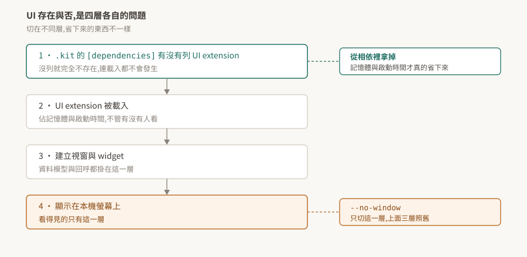

# 09 · omni.ui:UI 是 extension 提供的,所以它的有無是相依問題

「headless 的時候 UI 就不存在了吧」——這句話對了一半,而錯的那一半有實際成本。

UI 由 extension 提供,所以它存在與否由 `.kit` 的相依決定;而 `--no-window` 動的是最後一層。兩者省下來的東西不一樣。

> **驗證狀態**:§1、§2 引用官方逐字。**本 repo 沒有 Kit 環境,§3、§4 是從機制推的,未實機驗證**,驗法在 §5。

## 1. 什麼是 omni.ui

官方的定義:

> "The Omniverse UI Framework is the UI toolkit for creating beautiful and flexible graphical user interfaces in the Kit extensions."

注意最後三個字——**in the Kit extensions**。這不是一個獨立的 UI 函式庫,它是給 extension 用來長出介面的工具。這句話直接決定了 §3。

它提供基本 UI 元件與一套排版系統,元件都支援樣式覆寫。

## 2. MDV:資料與顯示分開

> "The widgets follow the Model-Delegate-View (MDV) pattern which highlights a separation between the data and the display logic."

Model 是資料、View 是顯示、Delegate 決定怎麼畫。分開的理由是同一份資料要能有多種呈現,而且改呈現不該動到資料。

實務上的意義:**資料模型可以獨立於顯示存在**。這一點在 §4 會再出現——沒有視窗不代表模型與回呼那一層不見了。

官方提供兩個互動式的示範 extension,`omni.example.ui` 展示元件與排版怎麼組合,`omni.kit.documentation.ui.style` 展示樣式系統。要學的話從這兩個進去比讀 API 文件快。

## 3. UI 的存在是相依問題

既然 UI 由 extension 提供,那麼「這個應用有沒有 UI」就跟「有沒有 UI extension 被拉進來」是同一個問題([02](../02-extension-system/README.md))。

拆成四層來看,切在不同層省下來的東西不同:

| 層 | 這一層決定什麼 | 怎麼切 |
|---|---|---|
| 1 | UI extension 在不在相依樹上 | 從 `.kit` 的 `[dependencies]` 拿掉 |
| 2 | 有沒有被載入(佔記憶體與啟動時間) | 同上,第 1 層決定 |
| 3 | 有沒有建立視窗與 widget | 由 extension 自己的邏輯決定 |
| 4 | 有沒有畫到本機螢幕 | `--no-window` |

**`--no-window` 切的是第 4 層。** 前面三層照舊:extension 載了、記憶體佔了、啟動時間花了、視窗物件可能也建了,只是沒有畫出來。

要真的省下那些,得動第 1 層——把 UI extension 從應用的相依裡拿掉,做一個本來就不含 UI 的 `.kit`。這也是為什麼同一套 SDK 底下會有「full」與比較精簡的多個 experience 檔([01 §3](../01-kit-is-the-framework/README.md))。

## 4. headless 下省不省得到

接 [06 §6](../06-run-modes/README.md) 那條推論,現在可以講得更精確:

- 想省**顯示**:`--no-window` 就夠了。
- 想省**記憶體與啟動時間**:要換一個不含 UI extension 的 `.kit` 檔。
- 想省**GPU**:兩個都不夠——算圖是另一條路徑,見 [06 §2](../06-run-modes/README.md)。

三件事三個切點,而它們常被當成同一件事。規劃遠端伺服器的資源時,把要省的是哪一種先講清楚,再決定動哪一層。

**以上是從機制推的,本 repo 未實測。** 特別是「`--no-window` 下 UI extension 仍被載入」這條,值得優先驗——它決定了上面那張表能不能拿來做資源規劃。

## 5. 待驗清單

| # | 待驗的斷言 | 怎麼驗 | 什麼算通過 |
|---|---|---|---|
| 1 | `--no-window` 下 UI extension 仍在啟用清單裡(§3) | 加該旗標啟動,查 UI 相關 extension 的狀態 | 仍列為啟用 |
| 2 | 從相依拿掉才真的省記憶體(§3) | 三種組態各量一次常駐記憶體與啟動時間:含 UI、含 UI 加 `--no-window`、不含 UI | 前兩者接近,第三者明顯較低 |
| 3 | 沒有視窗時資料模型仍可用(§2) | 在 `--no-window` 下建立一個 model 並讀寫 | 讀寫正常 |
| 4 | 不含 UI 的 `.kit` 能正常啟動(§3) | 寫一個最小的、不列任何 UI extension 的 `.kit` | 啟動成功,而 UI 相關 API 不存在 |

第 2 條是這篇唯一能落到數字的一條,也是唯一能拿去做資源規劃的一條。做的時候記得量測條件要一起記:Kit 版本、機器、樣本數。
