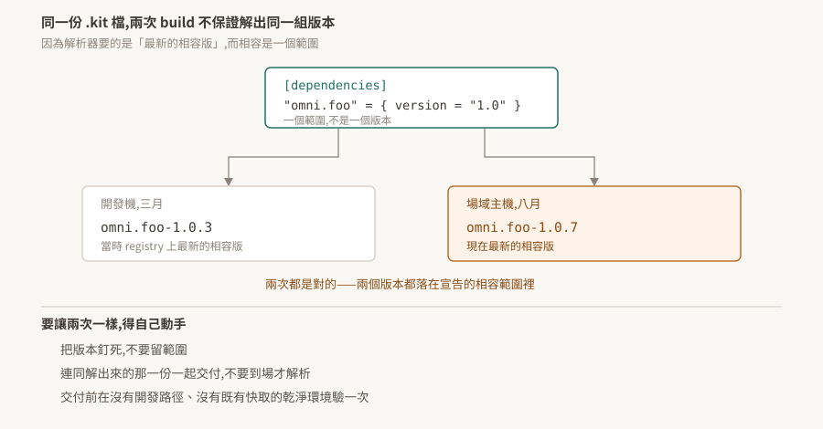

# 10 · 打包與發佈:同一份 `.kit` 檔,兩次 build 不保證一樣

開發機上測過的應用,搬到場域主機跑出不同的行為,而 `.kit` 檔一個字都沒改。

這不一定是環境問題。**`.kit` 檔宣告的是版本範圍,不是版本**,而解析器每次都去找當下最新的相容版——兩次 build 之間 registry 上多了一版,解出來的東西就不一樣了。

<p align="center"></p>

> **驗證狀態**:§1、§2 引用官方逐字。**§3 是從官方敘述與 [02](../02-extension-system/README.md) 的解析規則推的,本 repo 未實測**;§4 的做法同樣未驗證,§6 是驗法。

## 1. kit-app-template 提供什麼

官方對它的描述是「a framework for efficiently managing extensions and plugins」,提供「the tooling necessary for developers to assemble a blend of NVIDIA-provided and custom-developed extensions」。

重點在 **assemble a blend**——把 NVIDIA 提供的與自己寫的 extension 組起來。這正是 [01 §2](../01-kit-is-the-framework/README.md) 講的:應用就是一組 extension 的組合,而這個模板倉庫提供組合它們的工具鏈。

常用的兩個指令:

```bash
./repo.sh template new     # 產生新專案的骨架
./repo.sh build            # 建置 Kit SDK 實例與應用
```

Windows 上對應 `.\repo.bat`。

## 2. `.kit` 檔是 manifest

官方對 `.kit` 檔的另一個說法補上了 [01](../01-kit-is-the-framework/README.md) 沒講的一面:

> 它「function as a single-file extension and acts as a manifest, outlining the necessary extensions and their configuration」

**它自己就是一個 extension,同時扮演清單。** 這解釋了為什麼它的格式與 `extension.toml` 相同——它本來就是同一種東西,差別只在它是相依樹的根。

extension 這一側則是「uniquely named and versioned packages, loaded at runtime」,是「the fundamental building blocks」。**loaded at runtime** 這四個字是下一節的前提:組裝發生在執行期,不是編譯期。

## 3. 版本解析的不確定性

官方描述 Kit 管理相依版本的方式:

> "resolving and enabling the latest compatible versions of each extension, allowing for dynamic updates while maintaining a stable environment"

**最新的相容版**,而且明說目的之一是允許動態更新。把它跟 [02 §2](../02-extension-system/README.md) 的相容規則放在一起:相容是一個範圍(最左邊那個非零位相同),範圍裡通常有很多版。

推出來的結果:

> 同一份 `.kit` 檔,在兩個時間點、兩台機器上,可以解出不同的版本組合。**而兩次都是對的**——兩個版本都落在宣告的範圍裡。

[02 §3](../02-extension-system/README.md) 那條「偏好本地已下載的勝過遠端更新的」在這裡有雙面性:

- 好的一面:開發機上一旦解到某一版,後續啟動會穩定用它,不會每次都變。
- 麻煩的一面:**正因為開發機穩定,所以「在我這台測過」對一台空的新機器沒有證明力**。新機器沒有快取,它會去 registry 拿當下最新的相容版。

這一條與 [02 §4.1](../02-extension-system/README.md) 的 `devPaths` 忽略版本檢查是兩個獨立的機制,但造成的誤判形狀相同:**開發機上的成功來自那台機器的特殊狀態,而不是來自這份設定本身。**

## 4. 三道防線

要讓兩次 build 出來的東西一樣,得自己動手。三個做法可以疊加:

**一、把版本釘死。** `[dependencies]` 的一筆可以帶 `exact`([02 §2](../02-extension-system/README.md)),用它取代範圍宣告。**本 repo 沒有查證 `exact` 的確切語意與寫法**,採用前先看手上版本的文件確認。

**二、連同解出來的那一份一起交付。** extension 是「loaded at runtime」,所以只交付 `.kit` 檔等於把解析這一步留到場域主機上做,而那台的 registry 可及性、快取狀態都不在掌控內。把解析結果一起打包,到場就不必再解。這也順帶解決離線環境的問題——場域主機常常連不出去。

**三、在乾淨環境驗一次。** 交付前跑一次「沒有開發路徑、沒有既有快取」的建置與啟動。這一步是前兩道防線的驗收:如果解出來的東西與開發機不同,問題會在這裡浮現,而不是在客戶那裡。

## 5. 交付前的檢查

把前面幾篇的相關條目收在一起,交付前值得逐項確認:

- [ ] 沒有依賴 `devPaths` / `devFolders`([02 §4.1](../02-extension-system/README.md))
- [ ] 版本宣告是釘死的,不是範圍(§4)
- [ ] 在空快取的機器上建置並啟動成功(§4)
- [ ] 啟動後查一次能力在不在,不看回傳值([08 §2](../08-debugging/README.md))
- [ ] 設定的實際生效值與預期一致([03 §7](../03-carb-settings/README.md))
- [ ] 離線環境下不會卡在 registry([02 §4](../02-extension-system/README.md))

## 6. 待驗清單

| # | 待驗的斷言 | 怎麼驗 | 什麼算通過 |
|---|---|---|---|
| 1 | 同一份 `.kit` 在不同時間解出不同版本(§3) | 記下一次建置解出的版本;等 registry 有新的相容版後,在空快取機器上再建一次 | 兩次的版本清單不同 |
| 2 | `exact` 能釘死版本(§4) | 用 `exact` 宣告,在空快取機器上建置 | 解出的就是指定的那一版 |
| 3 | 空快取機器與開發機解出的結果不同(§3) | 同一份設定,兩台機器各建一次並比對版本清單 | 清單有差異 |
| 4 | 打包解析結果之後不再需要 registry(§4) | 斷網啟動打包好的應用 | 啟動成功 |
| 5 | `./repo.sh build` 的產物包含哪些東西(§1) | 建置一次,盤點輸出目錄 | 列得出清單,並確認 Kit SDK 實例是否在內 |

第 1 與第 3 條是這篇的骨幹。在驗到之前,把「版本可能會漂」當成預設假設處理——**成本是在交付流程裡多一道釘版本的步驟,而漏掉它的成本是在客戶現場除錯一個開發機上重現不了的問題。**
